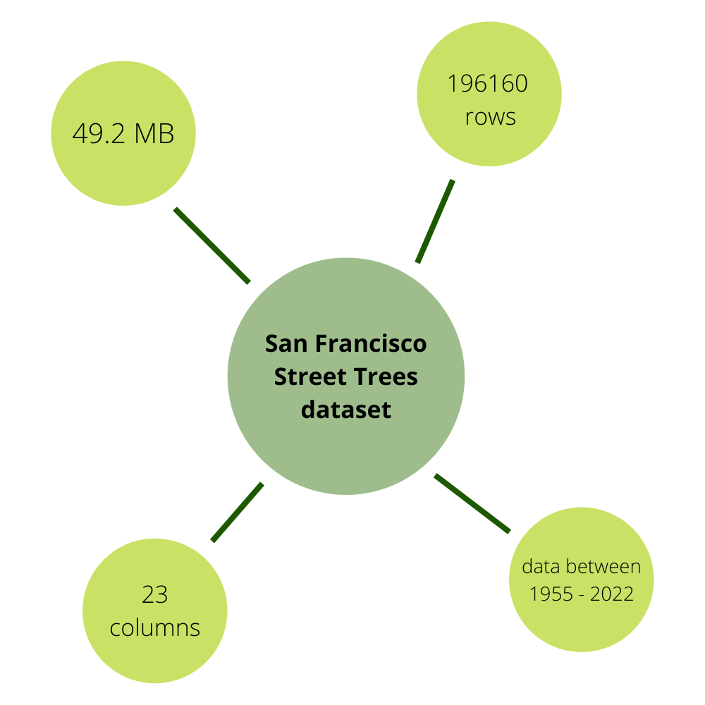
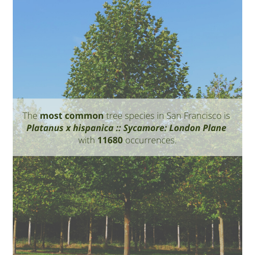
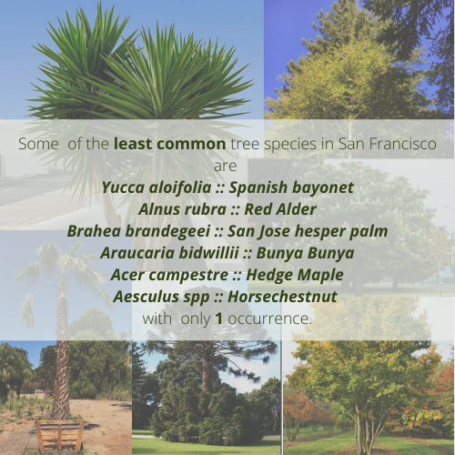

## Introduction

### Motivation
TODO
- why this topic is interesting
- how trees influence our lives
- what do we want to investigate
- what questions do we want to answer

TODO
- introduce the structure of the page
- provide link to the notebook

PLOTS HOWTO:
  - short introduction why do we show this plot
  - title, axes, colors, labels, ticks, caption
  - observations written under the plot

### Datasets
TODO
- why did we choose SF data
- link to the notebook

#### Tree dataset
The dataset is the list of maintained street trees in San Francisco including their planting date, species, and location. Please note, that the dataset is updated quite frequently, but since we access the data through the API of the OpenSF organization, our analysis remains up-to-date and shows the visualisations with the latest data. The data is openly accessible **[here](https://data.sfgov.org/City-Infrastructure/Street-Tree-List/tkzw-k3nq)**.

##### Overview of data
This section gives an overview of the data by showing the basic statistics of the dataset.

<figure>
  
</figure>

> Figure 1: Statistics of Street Trees data in San Francisco

The overall data consists of 196160 rows and 23 rows with 49.2 MB file size. Trees are listed with planting dates between 1955 and 2022.

In the following table we introduce the columns we use for analysis.

| Column name | Description | Type |
| --- | --- | --- |
| ```TreeID``` | Unique ID of tree | Number |
| ```qSpecies``` | Species of tree | Text |
| ```PlantDate``` | Date tree was planted | DateTime |
| ```Latitude``` | Y coordinate of tree | Number |
| ```Longitude``` | X coordinate of tree | Number |
| ```Latitude``` | Y coordinate of tree | Number |
| ```Police Districts``` | Indentifier number of police district where the tree is located | Number |
| ```Zip Codes``` | Zip code of the area where the tree is located | Number |

*Note: Around 16000 trees do not have location data or valid species type, those were removed from the dataset during preprocessing and will not be used during the analysis. **There are 180611 unique trees in the reduced dataset.***

The following interactive map shows the location of the registered trees from the reduced dataset in San Francisco.

<iframe src="./maps/map_trees_all.html" width="100%" height="500px"></iframe>

> Figure 2: Interactive map of all trees with registered location in San Francisco

As the map shows, most of the trees are located on the east side of San Francisco, the density is a bit lower on the west side and data is missing in the public parks, probably because they are maintained and registered by an organization other than [The City Department of Public Works (DPW)](https://sfpublicworks.org/).

##### Fundamental aspects of the data
This section gives a deeper insight to the dataset by analysing the trees by species, years and areas.

**Species**

The **most common** tree species in San Francisco is *Platanus x hispanica :: Sycamore: London Plane* with *11680* occurences.

The **least common** tree species in San Francisco are e.g.:
- *Yucca aloifolia :: Spanish bayonet*
- *Alnus rubra :: Red Alder*
- *Brahea brandegeei :: San Jose hesper palm*
- *Araucaria bidwillii :: Bunya Bunya*
- *Acer campestre :: Hedge Maple*

with only 1 occurence.

<div class="imageContainer">
	<figure>
	  
	</figure>
	<figure>
	  
	</figure>
</div>

TODO: fix image ticks that are hidden on bar chart (and add bar chart)
The data contains 571 species across 180611 trees, from which the **10 most common types** are the following:

<table>
	<tbody>
		<tr>
			<td><b>Species name</b></td>
			<td><b>Number of trees</b></td>
			<td><b>Map</b></td>
		</tr>
		<tr>
			<td>Platanus x hispanica - Sycamore: London Plane</td>
			<td>11680</td>
			<td><iframe src="./maps/map_species_1.html" width="450px" height="400px"></iframe></td>
		</tr>
		<tr>
			<td>Metrosideros excelsa - New Zealand Xmas Tree</td>
			<td>8757</td>
			<td><iframe src="./maps/map_species_2.html" width="450px" height="400px"></iframe></td>
		</tr>
		<tr>
			<td>Lophostemon confertus - Brisbane Box</td>
			<td>8735</td>
			<td><iframe src="./maps/map_species_3.html" width="450px" height="400px"></iframe></td>
		</tr>
		<tr>
			<td>Tristaniopsis laurina - Swamp Myrtle</td>
			<td>7400</td>
			<td><iframe src="./maps/map_species_4.html" width="450px" height="400px"></iframe></td>
		</tr>
		<tr>
			<td>Pittosporum undulatum -  Victorian Box</td>
			<td>7191</td>
			<td><iframe src="./maps/map_species_5.html" width="450px" height="400px"></iframe></td>
		</tr>
		<tr>
			<td>Prunus cerasifera - Cherry Plum</td>
			<td>6700</td>
			<td><iframe src="./maps/map_species_6.html" width="450px" height="400px"></iframe></td>
		</tr>
		<tr>
			<td>Magnolia grandiflora - Southern Magnolia</td>
			<td>6360</td>
			<td><iframe src="./maps/map_species_7.html" width="450px" height="400px"></iframe></td>
		</tr>
		<tr>
			<td>Arbutus 'Marina' - Hybrid Strawberry Tree</td>
			<td>5660</td>
			<td><iframe src="./maps/map_species_8.html" width="450px" height="400px"></iframe></td>
		</tr>
		<tr>
			<td>Ficus microcarpa nitida 'Green Gem' - Indian Laurel Fig Tree 'Green Gem'</td>
			<td>5574</td>
			<td><iframe src="./maps/map_species_9.html" width="450px" height="400px"></iframe></td>
		</tr>
		<tr>
			<td>Prunus serrulata 'Kwanzan' - Kwanzan Flowering Cherry</td>
			<td>4004</td>
			<td><iframe src="./maps/map_species_10.html" width="450px" height="400px"></iframe></td>
		</tr>
	</tbody>
</table>

Trees over the years
- plot: animation of planted trees over the years
- number of trees planted per year
- year with the least planted trees
- year with the most planted trees
- average number of planted trees per year
- plot: bar plot over average number of planted trees per year by type and adding its standard deviation
- define 'focus trees'?
- plot: bar charts displaying the year-by-year development of each tree types in the range X-Y
- comment on 3 interesting trends in the plot

Trees per area
- which area has the most trees (based on zip code)
- plot: plot zip code areas and color based on the number of trees? (we have done it for vehicle thefts on Sundays in PDDistricts)

#### Crime dataset
TODO
- link to the data
- short introduction

##### Overview of data
TODO
- basic infos about the data
  - number of rows, columns
  - size
  - date range
  - mention why we skip data in 2018
  - map of crimes?

##### Fundamental aspects of the data
Categories
- number of crimes in the dataset
- various types of crimes, how many are there
- number of crimes in each category
- most commonly occuring type of crime
- least commonly occuring type of crime
- plot: bar plot over crime type occurences
- define and explain groups: violent, non-violent, non-crime
- plot: heatmap of each group

Crimes over the years
- number of crimes per year
- year with the least number of crimes
- year with the most number of crimes
- average number of crimes per year
- plot: bar plot over average number of crimes per year by type and adding its standard deviation
- define 'focus crimes'
- plot: bar charts displaying the year-by-year development of each crime types in the range X-Y
- comment on 3 interesting trends in the plot

Crimes per area
- which area has the most crimes (based on PDDistrict)
- discuss stereotypes of certain neighbourhoods and compare with results
- plot: plot PDDistricts and color based on the number of crimes? (we have done it for vehicle thefts on Sundays in PDDistricts)

## Analysing the correlation between tree density and crime occurences
- what are we expecting
- what questions do we want to answer
  - connection between number of trees and number of crimes in general? (in 100mx100x areas on heatmap)
    - plot: heatmap of crimes
    - plot: heatmap of trees
    - calculate correlation
    - draw conclusion
  - is there an area where the more trees are the less crimes happen and vica versa?
    - plot: heatmap of crimes per pddistrict
    - plot: heatmap of trees per pddistrict
      - define zip codes for each pddistrict
    - calculate correlation for each area
    - draw conclusion
  - is there a drop in crimes as trees are planted over time?
    - animation of planting trees over the year + crimes in the same animation with different color?
    - make observations
    - support observations with calculations and data
  - prediction of number of crimes in area if X number of trees are planted
    - machine learning model
    - linear regression
    - checking the trees after the last planting date, so we consider "all" trees that can influence the number of crimes
    - do linear regression for tree types vs crime types as well
    - check correlation between tree types and crimes types

## Conclusion
- write conclusion of findings
- what could have we done better
- mention any areas with missing data (e.g. the park where no trees are listed in the dataset)

## References
