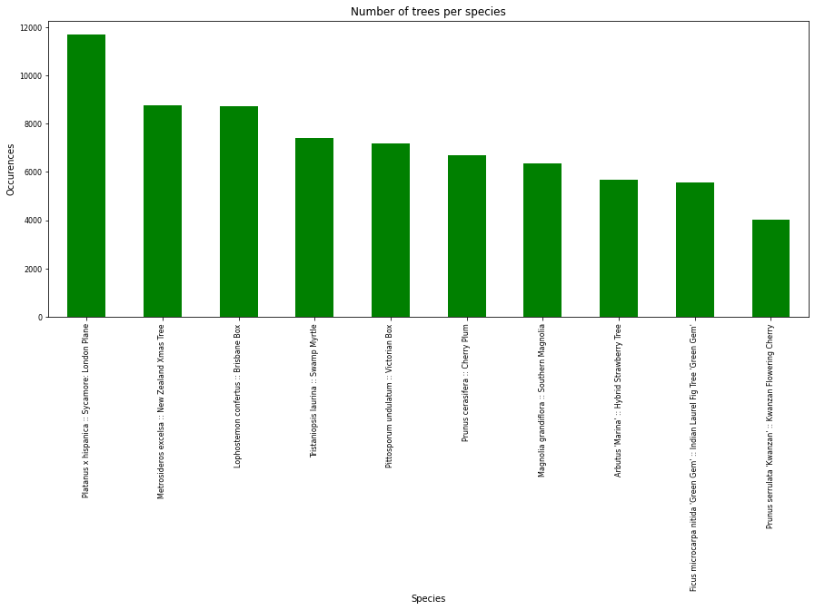
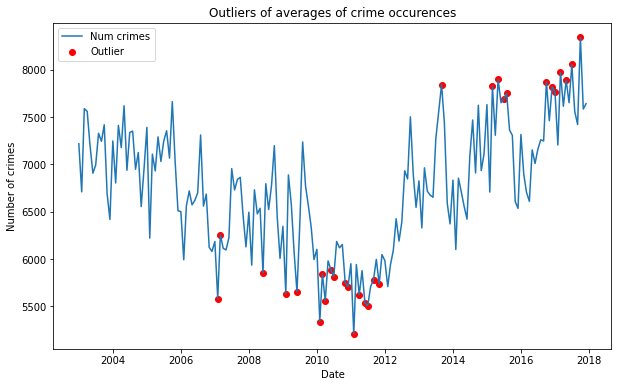
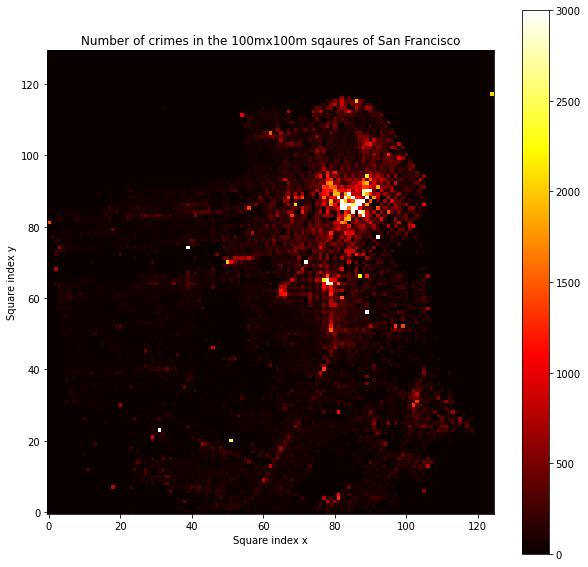

This webpage was created as an assignment for the [Social Data Analysis and Visualisation](https://kurser.dtu.dk/course/02806) course at DTU in 2022. The site presents our findings on the connection between tree density and crime occurences in San Francisco. Please find the repository of this GitHub page **[here](https://github.com/noramurakozy/SDA_web/tree/gh-pages)**.

TODO: regenerate TOC when we're done

## Table of contents
- [Introduction](#introduction)
  * [Motivation](#motivation)
  * [Datasets](#datasets)
    + [Tree dataset](#tree-dataset)
      - [Overview of data](#overview-of-data)
      - [Fundamental aspects of the data](#fundamental-aspects-of-the-data)
    + [Crime dataset](#crime-dataset)
      - [Overview of data](#overview-of-data-1)
      - [Fundamental aspects of the data](#fundamental-aspects-of-the-data-1)
- [Analysing the correlation between tree density and crime occurences](#analysing-the-correlation-between-tree-density-and-crime-occurences)
- [Conclusion](#conclusion)
- [References](#references)

## Introduction
This section introduces our motivation behind choosing this topic the describes the 2 datasets we're using in detail.

### Motivation
First, when we were looking for a dataset to work on and analyse in the 'green' topic, we all found it promising to have a look at trees and their influence on our lives. In addition, almost every city has its own maintained dataset of trees including their species, planting date and so on. During the research process we learned that trees have a great influence on people's lives and their environment. According to [this article](https://www.treesaregood.org/treeowner/benefitsoftrees), having trees in our everyday environment has the following benefits:
- **Social benefits**
	- Help people feel serene, peaceful, restful, and tranquil
	- Reduce workplace stress and fatigue
	- Decrease the recovery time following medical procedures
	- *Lower the amount of criminal activity in a community*
- **Communal benefits**
	- Serve architectural and engineering functions by providing privacy, emphasizing views or obstructing objectionable views
	- Reduce noise and glare
	- Bring natural elements and wildlife habitats into urban surroundings
- **Environmental benefits**
	- Filter the air we breathe by removing dust and other particles
	- Cool homes in the summer and allow the winter sun to heat homes when they lose their leaves4
	- Serve as a windbreak

and many more.

In the social benefits category, we can see that the presence of trees can lower the criminal activity in an area. This fact was one of the inspirations of the proposed [urban forest plan](https://sfplanning.org/urban-forest-plan) in San Francisco. They list 'reduced crime rate' as one of the benefits of planting trees along the streets in the city. Two papers are also cited on the page to prove that trees really can have an influence on crime rate in a city [[1]](https://www.sciencedirect.com/science/article/abs/pii/S0169204612000977#:~:text=The%20more%20conservative%20spatially%20adjusted,roughly%2012%25%20decrease%20in%20crime.) [[2]](https://journals.sagepub.com/doi/abs/10.1177/0013916501333002#:~:text=Although%20vegetation%20has%20been%20positively,and%20less%20aggressive%20and%20violent). These studies were made based on data collected in other cities in the USA, but if planting trees worked in different settings, why not to try in San Francisco as well? Since, we haven't found any resource on the correlation between tree coverage and crime rate in San Francisco, we decided to investigate this topic and find out if it's worth planting more trees in order to turn San Francisco into a more peaceful city.

This website guides the reader through the process of investigating the street tree and crime dataset of San Francisco and gives insights into the connection between density of trees in specific areas and the evolution of crimes in the same areas. The website serves as the main information source and tells the story of our project by including pictures, interactive maps and our observations for each small topic we investigated. The code and calculations can be found here if the reader wants to have a deeper look: **TODO link to the notebook**.

TODO: delete when we're ready with the proofreading

PLOTS HOWTO:
  - short introduction why do we show this plot
  - title, axes, colors, labels, ticks, caption
  - observations written under the plot

### Datasets
This section describes the 2 datasets we were working with, starting with the street tree dataset in San Francisco. We provide the same statistics and insights to the datasets, so the reader can easily make a connectiong between the 2 datasets. Further analysis between the two can be found in [Section 2](#analysing-the-correlation-between-tree-density-and-crime-occurences).

#### Tree dataset
The dataset is the list of maintained street trees in San Francisco including their planting date, species, and location. Please note, that the dataset is updated quite frequently, but since we access the data through the API of the OpenSF organization, our analysis remains up-to-date and shows the visualisations with the latest data. The data is openly accessible **[here](https://data.sfgov.org/City-Infrastructure/Street-Tree-List/tkzw-k3nq)**.

##### Overview of data
This section gives an overview of the data by showing the basic statistics of the dataset.

<figure>
  
</figure>

> Figure 1: Statistics of Street Trees data in San Francisco

The overall data consists of **196160 rows** and **23 columns** with **49.2 MB** file size. Trees are listed with planting dates **between 1955 and 2022**.

In the following table we introduce the columns we use for analysis.

| Column name | Description | Type |
| --- | --- | --- |
| ```TreeID``` | Unique ID of tree | Number |
| ```qSpecies``` | Species of tree | Text |
| ```PlantDate``` | Date tree was planted | DateTime |
| ```Latitude``` | Y coordinate of tree | Number |
| ```Longitude``` | X coordinate of tree | Number |
| ```Latitude``` | Y coordinate of tree | Number |
| ```Police Districts``` | Indentifier number of police district where the tree is located | Number |
| ```Zip Codes``` | Zip code of the area where the tree is located | Number |

> Table 1: Columns used for analysis and their short description

*Note: Around 16000 trees do not have location data or valid species type, those were removed from the dataset during preprocessing and will not be used during the analysis. **There are 180611 unique trees in the reduced dataset.***

The following interactive map shows the location of the registered trees from the reduced dataset in San Francisco.

<iframe src="./maps/map_trees_all.html" width="100%" height="500px"></iframe>

> Figure 2: Interactive map of all trees with registered location in San Francisco

As the map shows, most of the trees are located on the east side of San Francisco, the density is a bit lower on the west side and data is missing in the public parks, probably because they are maintained and registered by an organization other than [The City Department of Public Works (DPW)](https://sfpublicworks.org/).

##### Exploratory analysis
This section gives a deeper insight to the dataset by analysing the trees by species, years and areas.

**Species**

The **most common** tree species in San Francisco is *Platanus x hispanica :: Sycamore: London Plane* with *11680* occurences.

The **least common** tree species in San Francisco are e.g.:
- *Yucca aloifolia :: Spanish bayonet*
- *Alnus rubra :: Red Alder*
- *Brahea brandegeei :: San Jose hesper palm*
- *Araucaria bidwillii :: Bunya Bunya*
- *Acer campestre :: Hedge Maple*

with only 1 occurence.

<div class="imageContainer">
	<figure>
	  
	</figure>
	<figure>
	  
	</figure>
</div>

The data contains 571 species across 180611 trees, from which the **10 most common types** are the following:

<figure>
  
</figure>

> Figure 3: The occurences of the most common tree species in San Francisco

The following table and maps show the location of these species across San Francisco.

<table>
	<tbody>
		<tr>
			<td><b>Species name</b></td>
			<td><b>Number of trees</b></td>
			<td><b>Map</b></td>
			<td><b>Image</b></td>
		</tr>
		<tr>
			<td>Platanus x hispanica - Sycamore: London Plane</td>
			<td>11680</td>
			<td><iframe src="./maps/map_species_1.html" width="450px" height="400px"></iframe></td>
			<td></td>
		</tr>
		<tr>
			<td>Metrosideros excelsa - New Zealand Xmas Tree</td>
			<td>8757</td>
			<td><iframe src="./maps/map_species_2.html" width="450px" height="400px"></iframe></td>
			<td></td>
		</tr>
		<tr>
			<td>Lophostemon confertus - Brisbane Box</td>
			<td>8735</td>
			<td><iframe src="./maps/map_species_3.html" width="450px" height="400px"></iframe></td>
			<td></td>
		</tr>
		<tr>
			<td>Tristaniopsis laurina - Swamp Myrtle</td>
			<td>7400</td>
			<td><iframe src="./maps/map_species_4.html" width="450px" height="400px"></iframe></td>
			<td></td>
		</tr>
		<tr>
			<td>Pittosporum undulatum -  Victorian Box</td>
			<td>7191</td>
			<td><iframe src="./maps/map_species_5.html" width="450px" height="400px"></iframe></td>
			<td></td>
		</tr>
		<tr>
			<td>Prunus cerasifera - Cherry Plum</td>
			<td>6700</td>
			<td><iframe src="./maps/map_species_6.html" width="450px" height="400px"></iframe></td>
			<td></td>
		</tr>
		<tr>
			<td>Magnolia grandiflora - Southern Magnolia</td>
			<td>6360</td>
			<td><iframe src="./maps/map_species_7.html" width="450px" height="400px"></iframe></td>
			<td></td>
		</tr>
		<tr>
			<td>Arbutus 'Marina' - Hybrid Strawberry Tree</td>
			<td>5660</td>
			<td><iframe src="./maps/map_species_8.html" width="450px" height="400px"></iframe></td>
			<td></td>
		</tr>
		<tr>
			<td>Ficus microcarpa nitida 'Green Gem' - Indian Laurel Fig Tree 'Green Gem'</td>
			<td>5574</td>
			<td><iframe src="./maps/map_species_9.html" width="450px" height="400px"></iframe></td>
			<td></td>
		</tr>
		<tr>
			<td>Prunus serrulata 'Kwanzan' - Kwanzan Flowering Cherry</td>
			<td>4004</td>
			<td><iframe src="./maps/map_species_10.html" width="450px" height="400px"></iframe></td>
			<td></td>
		</tr>
	</tbody>
</table>

> Table 2: The occurences of the most common tree species in San Francisco and their location on interactive maps

**Trees over the years**

In 2008 4278 trees were planted, which is the hightest amount in the registered time period, although in 1955 only 6 trees were planted, which is the lowest amount in the registered time period. On average, 1077 trees were planted per year, 99 per month and 8 per day.

<figure>
  
</figure>

> Figure 4: The number of trees planted in each year between 1955 and 2022 in San Francisco

The following movie is a good representation of the planted trees over the years. The movie shows the planted trees in each year between 1972 and 2022. (We decided to show the movie from 1972 and not 1955, because from 1972 the city started planting trees in each year without gap, before that, the planting activity was not that significant.) 

We can see that most of the time the trees were scattered over the city. Although there are some years we can highlight, when the organization focused on specific areas or districts in San Francisco. For example, in *2006* the city really focused on planting trees along the *25th, 26th and 27th Avenue in Taraval* and along the *Ingalls street in Bayview*. In *2007* many trees were planted along the *28th and 24th Avenue in Taraval* and along the *main streets of the Southern districts*. In *2008*, most of the trees were planted in *Richmond disctrict (just above the Golden Gate Park)*, the street pattern is outlined clearly as well. These are the highlights that worth mentioning, but each year can be investigated by playing the movie below, pausing it, step between the years and zoom in on the map to have closer look.

<iframe src="./maps/map_trees_animation.html" width="100%" height="500px"></iframe>

> Figure 5: Interactive map movie of the planted trees between 1972 and 2022

By calculating the standard daviation of the number of trees over the years, we can observe the extent of the difference of number the planted trees compared to the average. As standard deviation is the quantity expressing how much the members of a group differ from the mean value for the group, we can conclude here, that for the trees in the *Arbutus Marina* species, the planted trees per year strongly differ from the mean of the yearly count. We can notice the same pattern in all the selected species, although in the case of *Ficus microcarpa nitida* it's not that significant. Figure 5 illustrates the average number of planted trees per year by species and their standard deviations as error bars. Due to the large selection of tree species (571 unique species in total), we decided to work with the most common species which were introduced earlier in Table 2, but listed here as well:

*Focus species:*
- Prunus serrulata 'Kwanzan' :: Kwanzan Flowering Cherry
- Ficus microcarpa nitida 'Green Gem' :: Indian Laurel Fig Tree 'Green Gem'
- Arbutus 'Marina' :: Hybrid Strawberry Tree
- Magnolia grandiflora :: Southern Magnolia
- Prunus cerasifera :: Cherry Plum
- Pittosporum undulatum :: Victorian Box
- Tristaniopsis laurina :: Swamp Myrtle
- Lophostemon confertus :: Brisbane Box
- Metrosideros excelsa :: New Zealand Xmas Tree
- Platanus x hispanica :: Sycamore: London Plane

<figure>
  
</figure>

> Figure 6: The average number of trees planted per year by species and their standard deviation

Another interesting change to investigate is the year-by-year development of the tree species. On Figure 6 we can see how many trees were planted for each species per year. The green color indicates high amount of planted trees in the year, read indicates low amount and the yellow color transitions for the amounts in between. 

<figure>
  
</figure>

> Figure 7: Yearly amount of planted trees per focus tree species

These are the most interesting observations we can read from these plots:
- *Ficus microcarpa nitida 'Green Gem' :: Indian Laurel Fig Tree 'Green Gem'*: Despite the low amount of trees planted from this species in general (maximum is less than 40 in a year), the number of trees per year was quite consistent and in most of the years, the amount was close to the max number of planted trees from this species. Seeing the consistency across the years also supported by the standard deviation of this species, shown in Figure 5, as this was the type which had the lowest standard deviation, meaningly the fluctuation of the number of planted trees throughout the years is low.
- *Arbutus 'Marina' :: Hybrid Strawberry Tree*: As opposed to the previously introduced species (Ficus), this plot has a well distinguishable peak in 2008, where extreme amount of trees were planted, nearly 500. In other years, the amount remained close to 100. This can be read (or at least suspected) by looking at Figure 5, because this species has the largest standard deviation, meaningly the tree counts are mostly far from the mean, which is understandable, since the mean is highly influenced by this peak.
- *Prunus cerasifera :: Cherry Plum*: Interestingly, this plot has a bell shape, which means that in the early years they did not plant that many trees of this species, but they focused on planting trees between 1995 and 2005, gradually increasing, then decreasing the number of planted trees. After 2005, the amount decreased gradually and less than 50 trees were planted a year.

*Finding outliers*

We could see from the previous analyzations that there are some year that were exceptional in terms on planting trees. Therefore, next we investigate outliers across all plated trees, not restricted to specific species. The way we do that is calculating the outliers first with [window rolling calculations](https://towardsdatascience.com/dont-miss-out-on-rolling-window-functions-in-pandas-850b817131db) and finding years that fall outside of the boundaries. Then, we calculate the outliers again, but this time with the [IsolationForest](https://scikit-learn.org/stable/modules/generated/sklearn.ensemble.IsolationForest.html) algorithm and lastly we compare the 2 sets of years and investigate those specific dates that were found by both methods.

*Window rolling*

Firstly, the boundaries are defined for a 24 months rolling window and with the help of this window's standard deviations, the lower theshold (by extracting the std from the mean) and upper threshold (by adding the std to the mean) are defined. The outliers are incidated with red dots on the plot and we can see that in 2000 exceptionally large amount of trees were planted compared to the average. There are other outliers as well, but they are not that significant. There are **11 outliers** in total out of the 593 total data points.

<figure>
  
</figure>

> Figure 8: Outliers outside of the rolling area of the average number of trees planted

*Isolation Forest*
The IsolationForest ‘isolates’ observations by randomly selecting a feature and then randomly selecting a split value between the maximum and minimum values of the selected feature. Since recursive partitioning can be represented by a tree structure, the number of splittings required to isolate a sample is equivalent to the path length from the root node to the terminating node. Random partitioning produces noticeably shorter paths for anomalies. Hence, when a forest of random trees collectively produce shorter path lengths for particular samples, they are highly likely to be anomalies. [1](https://scikit-learn.org/stable/modules/outlier_detection.html#isolation-forest) We set the contanimation to the ratio of outliers and total number of datapoints, which in our case was 0.0185.

<figure>
  
</figure>

> Figure 9: Outliers in number of trees planted calculated with the IsolationForest algorithm

The algorithm found 11 anomalies, but interestingly, these dates are different from the other 11 outliers found by the rolling method. The only matching month for outliers is *2000-06*.

These were the months found by the rolling calculations: `1979-04`, `1980-04`, `1982-04`, `1985-10`, `1992-05`, **`2000-06`**, `2005-12`, `2006-03`, `2014-12`, `2015-01`, `2017-10`
And by the IsolationForest: `1996-11`, `1998-05`, `1998-06`, **`2000-06`**, `2000-07`, `2002-05`, `2007-03`, `2008-02`, `2008-06`, `2008-07`, `2009-07`.

We tried to find resources on what happened in the highlighted month (June 2000), but we haven't found any articles that would support that a huge tree planting activity happened in that month, so we just conclude that in that month, exceptionally many trees were planted.

**Trees per area**

Another way to examine the tree population in San Francisco is to visualize their distribution across the Police Districts. Fortunately, the dataset we're working with provides that information about the individual tree. This type of visualisation can help us later while investigated the relevance of trees in a particular area in terms of crime occurences. The following interactive map shows the number of trees planted in each Police District, the darker the blue color, the more trees are planted there. *Tip: Hovering over an area gives more details about the district.*

<iframe src="./maps/tree_count_district.html" width="100%" height="500px"></iframe>

> Figure 10: Interactive map of number of trees planted in the different police districts in San Francisco

By looking at the map, we can conclude that the least amount of trees are in the Tenderloid district (1001) and most are located in Taraval (28551) and Ingleside (29738). Although, the reason behind these results can be the size of these areas. Tenderloid is really small compared to the latter districts, so it physically can't contain a lot of trees compared to the bigger districts. So, a more relevant visualisation here can be the density of trees in 100mx100m squares in San Francisco, because despite the low count in Tenderloin, the density might be higher than in the districts with bigger area. The following figure illustrates the density of trees in 100mx100m squares, the ligher the color, the higher the tree density in that area.

<figure>
  
</figure>

> Figure 11: Number of trees per 100m x 100m squares of San Francisco

The above figure shows that just below Tenderloin, on the edge of the Southern, Northern and Mission districts, the tree density is quite high. Our previous assumption that Tenderloin might have high tree coverage is not true, that makes Tenderloin a district with low amount of trees with low coverage.

Although this visualisation shows other interesting insights on the tree distribution in specific areas. There is a clear pattern of 2 vertical streets full of trees in the lower left corner in Taraval. Those streets are *Sunset Boulevard* and the *Junipero Serra Boulevard*. Sunset Boulevard is famous of its [beautiful trees and bushes](https://www.sfparksalliance.org/our-parks/parks/sunset-blvd) along the road, which gives a great free time activity environment for runners, cyclists, families etc. The final section of the Junipero Serra Boulevard is also [aligned with trees](https://en.wikipedia.org/wiki/Junipero_Serra_Boulevard) quite densly, but that's only true for its final section, as we can read it from the picture as well.

#### Crime dataset
The San Fransisco crime dataset is foreign to noone who has done the Social Data Analysis and Visualization course at DTU, it contains geo and time tagged data of all police activty in San Fransico from the year 2003 and into 2018, we however cut the year 2018 from our analysis as data capture was halted before the year was complete. Please note that while the dataset is often discussed as a crime data set, it it truly a dataset of all police interactions. Where some of those interactions are indeed crimes, many are not, so we will refer to total sums as interactions. [Link to dataset](https://data.sfgov.org/api/views/tmnf-yvry/rows.csv?accessType=DOWNLOAD)

##### Overview of data
Now that the content has been mentioned here are some stats about the memory size of the dataset: 
  - The SF crime dataset totals to `538 MB`, after cutting out 2018 and filtering for `focus crimes` the dataset contains `1214682 rows` and `38 columns`, containing all interactions from the `1st of January 2003` all the way to the `31st of December 2017`, as mentioned before data collection was halted midway into 2018 so we cut that year out to do our analysis only on full years as many of our calculations are based on total numbers over the span of a whole year. Also, we introduced the following focus crimes to be able to work on a smaller dataset which is easier to handle:

```focuscrimes = set(['WEAPON LAWS', 'PROSTITUTION', 'DRIVING UNDER THE INFLUENCE', 'ROBBERY', 'BURGLARY', 'ASSAULT', 'DRUNKENNESS', 'DRUG/NARCOTIC', 'TRESPASS', 'LARCENY/THEFT', 'VANDALISM', 'VEHICLE THEFT', 'STOLEN PROPERTY', 'DISORDERLY CONDUCT'])```

##### Exploratory analysis
Here we conduct an exploratory analysis on the crime dataset, so we can get more insights and get familiar with the data. This section gives a deeper insight to the dataset by analysing the crimes by category, years and areas.

**Categories**

- In total we are looking at **1064315 unique crimes** containing **14 unique crime types** (as it's filtered down), with the 5 most common types interactions being:
	- `LARCENY/THEFT` with 464337 occurances.
	- `ASSAULT` with 163151 occurances.
	- `VEHICLE THEFT` with 124744 occurances.
	- `DRUG/NARCOTIC` with 116345 occurances.
	- `VANDALISM` with 111932 occurances.
 
The next figure shows the 10 most common categories and their occurences on a bar plot. The plot shows that the **most common** crime category in San Francisco is *LARCENY/THEFT* with *464337* occurences. On the other hand, *PROSTITUTION* has the least amount of occurences, around 100000.

<figure>
  
</figure>

> Figure 12: Most common crimes and occurences in San Francisco

The following table and maps show the location of these crimes across San Francisco.

<table>
	<tbody>
		<tr>
			<td><b>Category name</b></td>
			<td><b>Number of crimes</b></td>
			<td><b>Map</b></td>
		</tr>
		<tr>
			<td>LARCENY/THEFT</td>
			<td>464337</td>
			<td><iframe src="./maps/map_crime_1.html" width="450px" height="400px"></iframe></td>
		</tr>
		<tr>
			<td>ASSAULT</td>
			<td>163151</td>
			<td><iframe src="./maps/map_crime_2.html" width="450px" height="400px"></iframe></td>
		</tr>
		<tr>
			<td>VEHICLE THEFT</td>
			<td>124744</td>
			<td><iframe src="./maps/map_crime_3.html" width="450px" height="400px"></iframe></td>
		</tr>
		<tr>
			<td>DRUG/NARCOTIC</td>
			<td>116345</td>
			<td><iframe src="./maps/map_crime_4.html" width="450px" height="400px"></iframe></td>
		</tr>
		<tr>
			<td>VANDALISM</td>
			<td>111932</td>
			<td><iframe src="./maps/map_crime_5.html" width="450px" height="400px"></iframe></td>
		</tr>
		<tr>
			<td>BURGLARY</td>
			<td>88970</td>
			<td><iframe src="./maps/map_crime_6.html" width="450px" height="400px"></iframe></td>
		</tr>
		<tr>
			<td>ROBBERY</td>
			<td>53414</td>
			<td><iframe src="./maps/map_crime_7.html" width="450px" height="400px"></iframe></td>
		</tr>
		<tr>
			<td>WEAPON LAWS</td>
			<td>20396</td>
			<td><iframe src="./maps/map_crime_8.html" width="450px" height="400px"></iframe></td>
		</tr>
		<tr>
			<td>TRESPASS</td>
			<td>18679</td>
			<td><iframe src="./maps/map_crime_9.html" width="450px" height="400px"></iframe></td>
		</tr>
		<tr>
			<td>PROSTITUTION</td>
			<td>16451</td>
			<td><iframe src="./maps/map_crime_10.html" width="450px" height="400px"></iframe></td>
		</tr>
	</tbody>
</table>

> Table 3: The occurences of the most common crime categories in San Francisco and their location on interactive maps

**Crimes over the years**

In this section we analyse the crime rate development in the city, we're interested in any peaks and valleys in the investigated time period.

The figure shows the number of crimes in each year in San Francisco. Most of the crimes happened in 2017 with around 90000 incidents. In 2011 only ~70000 crimes happened, which is the lowest amount in the registered time period.

<figure>
  
</figure>

> Figure 13: Number of crimes in each year in San Francisco

To mention exact numbers, in `2017` `92696` crime incidents occured, which is the hightest amount in the registered time period, while in `2011` `68910` crime incidents occured, which is the lowest amount in the registered time period. On average, `80978` crimes occured `yearly`, `6748 crimes occured monthly` and `221 occured daily`.

To further look at the changes over the years, we created a movie which is a good representation of the crimes occured over the years. The movie shows the crimes in each year between 2011 and 2017. We decided to examine this year range, because we can see a gradual increase starting from the year of 2011. Also, we decided to only investigate the `LARCENY/THEFT` category as the most common type of crime, because that would show a great trend of the changes in the crime categories.

<iframe src="./maps/map_crimes_animation.html" width="100%" height="500px"></iframe>

> Figure 14: Interactive movie of the yearly distribution of larceny/theft type of crimes in the years between 2011 and 2017

As we can read from the moview, the most common area of the investigated crime basically remaines the same - north-west section of the city - over the years, but the location of the incidents at the least frequented places changes from year to year.

To further examine the data, we calculate the standard daviation of the number of crimes over the years, so we can observe the extent of the difference of the number of crime incidents compared to the average.

<figure>
  
</figure>

> Figure 15: Average number of crimes per year and their standard deviation as error bars

As standard deviation is the quantity expressing how much the members of a group differ from the mean value for the group, we can conclude here, that for the crimes in the *LARCENY/THEFT* category, the crime occurences per year somewhat differ from the mean of the yearly count. We can notice the same pattern in category *VEHICLE/THEFT* and *DRUG/NARCOTIC*, although in the rest of the cases the difference is not that significant.

Another interesting area to investigate is the year-by-year development of the crime categories.

<figure>
  
</figure>

> Figure 16: Yearly development of crime occurences per crime category

Out of the 10 most common crime categories, 5 follows a similar trend and stays at a high number in each year. Although there are some categories we can highlight and investigate more:

* *LARCENY/THEFT:* As the first subfigure shows, crime occurences in the *LARCENY/THEFT* category follow a clear upwards trend over the years. In the first reported year, 2003, 'only' 25000 incidents were reported, while in the last year, 2017, the number of crimes almost reached 50000 in the year.
* *VEHICLE THEFT:* Vehicle theft was a quite common commited crime until 2006, when the number of crimes significantly dropped and remained under 9000 after that.
* *PROSTITUTION:* Prostitution rates was the highest in 2002, then decreased by 1000 cases in 2003. Unfortunately, it increased again in 2007, but gradually decreased by until 2015, when it has the lowest point with ~400 incidents in that year.

We could see from the previous analyzations that there are some year that were exceptional in terms of crime occurences. Therefore, next we investigate outliers across all crimes, not restricted to specific categories (but still within focus crime categories). The way we do that is calculating the outliers first with [window rolling calculations](https://towardsdatascience.com/dont-miss-out-on-rolling-window-functions-in-pandas-850b817131db) and finding months that fall outside of the boundaries. Then, we calculate the outliers again, but this time with the [IsolationForest](https://scikit-learn.org/stable/modules/generated/sklearn.ensemble.IsolationForest.html) algorithm and lastly we compare the 2 sets of months and investigate those specific dates that were found by both methods.

<figure>
  
</figure>

> Figure 17: Outliers in 24 months rolling window averages of crime occurences

Firstly, the boundaries are defined for a 24 months rolling window and with the help of this window's standard deviations, the lower theshold (by extracting the std from the mean) and upper threshold (by adding the std to the mean) are defined. The outliers are incidated with red dots on the plot and we can see that in the years of 2005, 2007, 2009 and 2013 exceptionally large amount of crimes happened compared to the average. There are other outliers as well, but they are not that significant. There are **30 outliers** in total out of the 180 total data points.

But to make sure we filter the real outliers, we use a different method as well, to calculate the outliers: the IsolationForest algorithm. Sklearn's [IsolationForest](https://scikit-learn.org/stable/modules/generated/sklearn.ensemble.IsolationForest.html) returns the anomaly score of each sample using the IsolationForest algorithm.
We calculate the outliers with another method as well and check the ones that were found by both methods.

<figure>
  
</figure>

> Figure 18: Outliers of averages of crime occurences using the IsolationForest algorithm

The algorithm found 30 anomalies, but interestingly, these dates are different from the other 30 outliers found by the rolling method. Let's see the outlier months that were found by both methods:

```
Outliers that both methods found:
Month: Feb, 2007 Count: 5582
Month: Feb, 2009 Count: 5632
Month: Jun, 2009 Count: 5652
Month: Feb, 2010 Count: 5339
Month: Feb, 2011 Count: 5208
Month: Oct, 2012 Count: 7502
Month: Sep, 2013 Count: 7843
Month: Mar, 2015 Count: 7827
Month: May, 2015 Count: 7897
Month: Oct, 2016 Count: 7873
Month: Mar, 2017 Count: 7972
Month: Jul, 2017 Count: 8055
Month: Oct, 2017 Count: 8340
```

12 months were found by both methods out of the 30 in total. There's no trend in the season when the peaks happened, there are cases in spring, summer, autumn and winter as well. Interestingly, 2017 is the year with the most peaks, which is consistent with the fact that that's the year with the most number of crimes. We can also notice that the number of crimes in the peak gradually increases as we're moving forward in time. That means that we need more and more crimes to fall outside of the defined threshold.

**Crimes per area**

Lastly, we analyse the location and distribution of the crimes in the city by visualizing them in Police Districts and calculating their density in 100mx100m squares of the city.

A way to examine the crime rate in San Francisco is to visualize their distribution across the Police Districts. The following interactive map shows the number of reported crimes in each police district.

<iframe src="./maps/crime_count_district.html" width="100%" height="500px"></iframe>

> Figure 19: Interactive maps of the number of crimes in each Police District

As the interactive map shows above, most of the crimes happened in the *SOUTHERN* district, with the exact number of 221.491k occurences. As we move towards the outside of the city, the less is the crime rate, for example in *RICHMOND* the number of crimes were only 65.28k. We can conclude here that most of the crimes happen in the inner city of San Francisco.

To look for further patterns we can calculate the crime density for each sqaure in San Francisco.

<figure>
  
</figure>

> Figure 20: Number of crimes in the 100mx100m sqaures of San Francisco

The figure illustrates the density of crimes in 100mx100m squares, the ligher the color, the higher the crime density in that area. 

As we have previously seen, the most dense area is still the inner city area of San Francisco (Southern district). Otherwise the crimes are quite scattered, because the squares are shown with nearly black color outside of the inner city. Although we haven't found new patterns with this illstration, we can support the fact that most of the crimes happen in the area of the inner city.

After thoroughly analyzing both datasets, it's time to move forward and look for the connection between tree density and crime rate in San Francisco.

## Analysing the correlation between tree density and crime occurences
During the analysis, we expect to get the same results as we have read in the papers written about the connection between trees and crime rate in an area. We expect to find results that can support the hypothesis, according to which, the more trees are planted the less crime incidents happen in a city. To find out, we calculate the correlation between tree density and crimes by investigating specific areas using linear regression.

### Correlation per area
Here we calculate the correlation between the tree density in a 100m\*100m area and the number of crimes that are committed in the same area. We are using [Pearson correlation](https://en.wikipedia.org/wiki/Pearson_correlation_coefficient) since this is the default behaviour of numpy's [corrcoeff function](https://numpy.org/doc/stable/reference/generated/numpy.corrcoef.html). This will give us insights on area specific correlation and patterns.

<figure>
  
</figure>

> Figure 21: Correlation of tree density and crime rate per 100m x 100m squares

We can see that some of the main streets of the city has high correlation between the trees and crimes. E.g. the middle part of San Jose Avenue has squares with relatively high correlation (more than 0.8), but we can't tell the same for the west coast of the city, where most of the sqaures has a correlation near to 0.

We also calculate the correlation coefficient, which is `0.1341`. The correlation is positive, however it is too small to prove the link the crime rate to the number of trees. Positive correlation means that the increasing number of trees in an area indicates higher crime rate. It contradicts the articles that we have found and meantioned in the Introduction, or at least the pattern cannot be identified using these two dataset.

### Correlation in time - Feri
- is there a drop in crimes as trees are planted over time?
    - animation of planting trees over the year + crimes in the same animation with different color?
    - make observations
    - support observations with calculations and data

### Linear regression - Feri
TODO: why we do this
#### Nr. of crimes in a month based on nr. of trees planted - Feri
- prediction of number of crimes in a month if X number of trees are planted
    - linear regression
#### Nr. of crimes in a Police District based on nr. of trees planted - Feri
- prediction of number of crimes in a district if X number of trees are planted
    - linear regression

## Discussion and conclusion
Overall, we did a throrough analysis on both datasets to get familiar with them and have insightful visulalization that helps to understand the data for the user as well. We also tried to produc as many interactive visualisations as possible, so the user can explore the data in more detail while experiencing a better UX, and not only looking at images.

Although, since there is no data about trees in the parks (because they are not street trees and probably are maintained by another organization than the author of our dataset), we do not have information about crimes happening in parks and their correlation with the tree density. It might have chenged the results a bit, but probably not significantly. It's quite surprising as well, that our results show that the more trees are planted in an area, the more crimes occured there. It's important to mention that the correlation was positive, but really low. So we can say that the more trees are planted the more crimes happen in an area, but since the correlation is really low, it's not enough to prove a clear link between trees and crimes. Which is not the result we would expect at first, also because of our inspiration project, the [Urban Forest Plan](https://sfplanning.org/urban-forest-plan) in San Francisco, where they mentioned lower crime rate as a possible benefit of planting trees. On their site, they cited 2 papers that investigated this topic in 2 other cities in the US, but it seems like planting trees did not help in the case of San Francisco, which is an interesting conclusion in the end, since that's not what a person would expect.

An explanation could be that criminals can hide better in areas where trees are densly planted or they just simply don't care about their surroundings and will commit the crime anyways.

To summarize, it was an interesting topic to analyse and investigate, and we enjoyed the process, despite the surprising results. It seems like the government in San Francisco has to look for other solutions to lower crime rate in the city.
