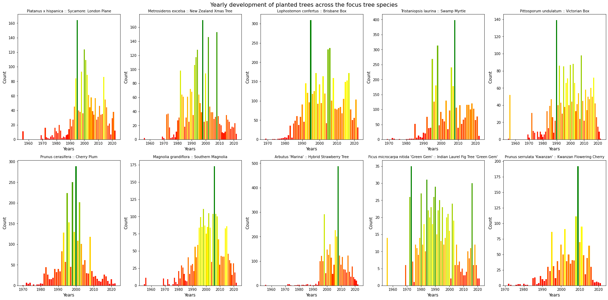

This webpage was created as an assignment for the [Social Data Analysis and Visualisation](https://kurser.dtu.dk/course/02806) course at DTU in 2022. The site presents our findings on the connection between tree density and crime occurences in San Francisco. Please find the repository of this GitHub page **[here](https://github.com/noramurakozy/SDA_web/tree/gh-pages)**.

## Table of contents
- [Introduction](#introduction)
  * [Motivation](#motivation)
  * [Datasets](#datasets)
    + [Tree dataset](#tree-dataset)
      - [Overview of data](#overview-of-data)
      - [Fundamental aspects of the data](#fundamental-aspects-of-the-data)
    + [Crime dataset](#crime-dataset)
      - [Overview of data](#overview-of-data-1)
      - [Fundamental aspects of the data](#fundamental-aspects-of-the-data-1)
- [Analysing the correlation between tree density and crime occurences](#analysing-the-correlation-between-tree-density-and-crime-occurences)
- [Conclusion](#conclusion)
- [References](#references)

## Introduction

### Motivation
TODO
SF Urban Forest plan: https://sfplanning.org/urban-forest-plan
- why this topic is interesting
- how trees influence our lives
- what do we want to investigate
- what questions do we want to answer

TODO
- introduce the structure of the page
- provide link to the notebook

PLOTS HOWTO:
  - short introduction why do we show this plot
  - title, axes, colors, labels, ticks, caption
  - observations written under the plot

### Datasets
TODO
- why did we choose SF data (https://sfplanning.org/urban-forest-plan)
- link to the notebook

#### Tree dataset
The dataset is the list of maintained street trees in San Francisco including their planting date, species, and location. Please note, that the dataset is updated quite frequently, but since we access the data through the API of the OpenSF organization, our analysis remains up-to-date and shows the visualisations with the latest data. The data is openly accessible **[here](https://data.sfgov.org/City-Infrastructure/Street-Tree-List/tkzw-k3nq)**.

##### Overview of data
This section gives an overview of the data by showing the basic statistics of the dataset.

<figure>
  
</figure>

> Figure 1: Statistics of Street Trees data in San Francisco

The overall data consists of **196160 rows** and **23 columns** with **49.2 MB** file size. Trees are listed with planting dates **between 1955 and 2022**.

In the following table we introduce the columns we use for analysis.

| Column name | Description | Type |
| --- | --- | --- |
| ```TreeID``` | Unique ID of tree | Number |
| ```qSpecies``` | Species of tree | Text |
| ```PlantDate``` | Date tree was planted | DateTime |
| ```Latitude``` | Y coordinate of tree | Number |
| ```Longitude``` | X coordinate of tree | Number |
| ```Latitude``` | Y coordinate of tree | Number |
| ```Police Districts``` | Indentifier number of police district where the tree is located | Number |
| ```Zip Codes``` | Zip code of the area where the tree is located | Number |

> Table 1: Columns used for analysis and their short description

*Note: Around 16000 trees do not have location data or valid species type, those were removed from the dataset during preprocessing and will not be used during the analysis. **There are 180611 unique trees in the reduced dataset.***

The following interactive map shows the location of the registered trees from the reduced dataset in San Francisco.

<iframe src="./maps/map_trees_all.html" width="100%" height="500px"></iframe>

> Figure 2: Interactive map of all trees with registered location in San Francisco

As the map shows, most of the trees are located on the east side of San Francisco, the density is a bit lower on the west side and data is missing in the public parks, probably because they are maintained and registered by an organization other than [The City Department of Public Works (DPW)](https://sfpublicworks.org/).

##### Fundamental aspects of the data
This section gives a deeper insight to the dataset by analysing the trees by species, years and areas.

**Species**

The **most common** tree species in San Francisco is *Platanus x hispanica :: Sycamore: London Plane* with *11680* occurences.

The **least common** tree species in San Francisco are e.g.:
- *Yucca aloifolia :: Spanish bayonet*
- *Alnus rubra :: Red Alder*
- *Brahea brandegeei :: San Jose hesper palm*
- *Araucaria bidwillii :: Bunya Bunya*
- *Acer campestre :: Hedge Maple*

with only 1 occurence.

<div class="imageContainer">
	<figure>
	  
	</figure>
	<figure>
	  
	</figure>
</div>

The data contains 571 species across 180611 trees, from which the **10 most common types** are the following:

<figure>
  
</figure>

> Figure 3: The occurences of the most common tree species in San Francisco

The following table and maps show the location of these species across San Francisco.

<table>
	<tbody>
		<tr>
			<td><b>Species name</b></td>
			<td><b>Number of trees</b></td>
			<td><b>Map</b></td>
			<td><b>Image</b></td>
		</tr>
		<tr>
			<td>Platanus x hispanica - Sycamore: London Plane</td>
			<td>11680</td>
			<td><iframe src="./maps/map_species_1.html" width="450px" height="400px"></iframe></td>
			<td></td>
		</tr>
		<tr>
			<td>Metrosideros excelsa - New Zealand Xmas Tree</td>
			<td>8757</td>
			<td><iframe src="./maps/map_species_2.html" width="450px" height="400px"></iframe></td>
			<td></td>
		</tr>
		<tr>
			<td>Lophostemon confertus - Brisbane Box</td>
			<td>8735</td>
			<td><iframe src="./maps/map_species_3.html" width="450px" height="400px"></iframe></td>
			<td></td>
		</tr>
		<tr>
			<td>Tristaniopsis laurina - Swamp Myrtle</td>
			<td>7400</td>
			<td><iframe src="./maps/map_species_4.html" width="450px" height="400px"></iframe></td>
			<td></td>
		</tr>
		<tr>
			<td>Pittosporum undulatum -  Victorian Box</td>
			<td>7191</td>
			<td><iframe src="./maps/map_species_5.html" width="450px" height="400px"></iframe></td>
			<td></td>
		</tr>
		<tr>
			<td>Prunus cerasifera - Cherry Plum</td>
			<td>6700</td>
			<td><iframe src="./maps/map_species_6.html" width="450px" height="400px"></iframe></td>
			<td></td>
		</tr>
		<tr>
			<td>Magnolia grandiflora - Southern Magnolia</td>
			<td>6360</td>
			<td><iframe src="./maps/map_species_7.html" width="450px" height="400px"></iframe></td>
			<td></td>
		</tr>
		<tr>
			<td>Arbutus 'Marina' - Hybrid Strawberry Tree</td>
			<td>5660</td>
			<td><iframe src="./maps/map_species_8.html" width="450px" height="400px"></iframe></td>
			<td></td>
		</tr>
		<tr>
			<td>Ficus microcarpa nitida 'Green Gem' - Indian Laurel Fig Tree 'Green Gem'</td>
			<td>5574</td>
			<td><iframe src="./maps/map_species_9.html" width="450px" height="400px"></iframe></td>
			<td></td>
		</tr>
		<tr>
			<td>Prunus serrulata 'Kwanzan' - Kwanzan Flowering Cherry</td>
			<td>4004</td>
			<td><iframe src="./maps/map_species_10.html" width="450px" height="400px"></iframe></td>
			<td></td>
		</tr>
	</tbody>
</table>

> Table 2: The occurences of the most common tree species in San Francisco and their location on interactive maps

**Trees over the years**

In 2008 4278 trees were planted, which is the hightest amount in the registered time period, although in 1955 only 6 trees were planted, which is the lowest amount in the registered time period. On average, 1077 trees were planted per year, 99 per month and 8 per day.

<figure>
  
</figure>

> Figure 4: The number of trees planted in each year between 1955 and 2022 in San Francisco

By calculating the standard daviation of the number of trees over the years, we can observe the extent of the difference of number the planted trees compared to the average. As standard deviation is the quantity expressing how much the members of a group differ from the mean value for the group, we can conclude here, that for the trees in the *Arbutus Marina* species, the planted trees per year strongly differ from the mean of the yearly count. We can notice the same pattern in all the selected species, although in the case of *Ficus microcarpa nitida* it's not that significant. Figure 5 illustrates the average number of planted trees per year by species and their standard deviations as error bars. Due to the large selection of tree species (571 unique species in total), we decided to work with the most common species which were introduced earlier in Table 2, but listed here as well:

*Focus species:*
- Prunus serrulata 'Kwanzan' :: Kwanzan Flowering Cherry
- Ficus microcarpa nitida 'Green Gem' :: Indian Laurel Fig Tree 'Green Gem'
- Arbutus 'Marina' :: Hybrid Strawberry Tree
- Magnolia grandiflora :: Southern Magnolia
- Prunus cerasifera :: Cherry Plum
- Pittosporum undulatum :: Victorian Box
- Tristaniopsis laurina :: Swamp Myrtle
- Lophostemon confertus :: Brisbane Box
- Metrosideros excelsa :: New Zealand Xmas Tree
- Platanus x hispanica :: Sycamore: London Plane

<figure>
  
</figure>

> Figure 5: The average number of trees planted per year by species and their standard deviation

Another interesting change to investigate is the year-by-year development of the tree species. On Figure 6 we can see how many trees were planted for each species per year. The green color indicates high amount of planted trees in the year, read indicates low amount and the yellow color transitions for the amounts in between. 

<figure>
  
</figure>

> Figure 6: Yearly amount of planted trees per focus tree species

These are the most interesting observations we can read from these plots:
- *Ficus microcarpa nitida 'Green Gem' :: Indian Laurel Fig Tree 'Green Gem'*: Despite the low amount of trees planted from this species in general (maximum is less than 40 in a year), the number of trees per year was quite consistent and in most of the years, the amount was close to the max number of planted trees from this species. Seeing the consistency across the years also supported by the standard deviation of this species, shown in Figure 5, as this was the type which had the lowest standard deviation, meaningly the fluctuation of the number of planted trees throughout the years is low.
- *Arbutus 'Marina' :: Hybrid Strawberry Tree*: As opposed to the previously introduced species (Ficus), this plot has a well distinguishable peak in 2008, where extreme amount of trees were planted, nearly 500. In other years, the amount remained close to 100. This can be read (or at least suspected) by looking at Figure 5, because this species has the largest standard deviation, meaningly the tree counts are mostly far from the mean, which is understandable, since the mean is highly influenced by this peak.
- *Prunus cerasifera :: Cherry Plum*: Interestingly, this plot has a bell shape, which means that in the early years they did not plant that many trees of this species, but they focused on planting trees between 1995 and 2005, gradually increasing, then decreasing the number of planted trees. After 2005, the amount decreased gradually and less than 50 trees were planted a year.

*Finding outliers*

We could see from the previous analyzations that there are some year that were exceptional in terms on planting trees. Therefore, next we investigate outliers across all plated trees, not restricted to specific species. The way we do that is calculating the outliers first with [window rolling calculations](https://towardsdatascience.com/dont-miss-out-on-rolling-window-functions-in-pandas-850b817131db) and finding years that fall outside of the boundaries. Then, we calculate the outliers again, but this time with the [IsolationForest](https://scikit-learn.org/stable/modules/generated/sklearn.ensemble.IsolationForest.html) algorithm and lastly we compare the 2 sets of years and investigate those specific dates that were found by both methods.

*Window rolling*

Firstly, the boundaries are defined for a 24 months rolling window and with the help of this window's standard deviations, the lower theshold (by extracting the std from the mean) and upper threshold (by adding the std to the mean) are defined. The outliers are incidated with red dots on the plot and we can see that in 2000 exceptionally large amount of trees were planted compared to the average. There are other outliers as well, but they are not that significant. There are **11 outliers** in total out of the 593 total data points.

<figure>
  
</figure>

> Figure 7: Outliers outside of the rolling area of the average number of trees planted

*Isolation Forest*
The IsolationForest ‘isolates’ observations by randomly selecting a feature and then randomly selecting a split value between the maximum and minimum values of the selected feature. Since recursive partitioning can be represented by a tree structure, the number of splittings required to isolate a sample is equivalent to the path length from the root node to the terminating node. Random partitioning produces noticeably shorter paths for anomalies. Hence, when a forest of random trees collectively produce shorter path lengths for particular samples, they are highly likely to be anomalies. [1](https://scikit-learn.org/stable/modules/outlier_detection.html#isolation-forest) We set the contanimation to the ratio of outliers and total number of datapoints, which in our case was 0.0185.

<figure>
  
</figure>

> Figure 8: Outliers in number of trees planted calculated with the IsolationForest algorithm

The algorithm found 11 anomalies, but interestingly, these dates are different from the other 11 outliers found by the rolling method. The only matching date for outliers is *2000-06-01*.

These were the dates found by the rolling calculations: `1979-04-01`, `1980-04-01`, `1982-04-01`, `1985-10-01`, `1992-05-01`, **`2000-06-01`**, `2005-12-01`, `2006-03-01`, `2014-12-01`, `2015-01-01`, `2017-10-01`
And by the IsolationForest: `1996-11-01`, `1998-05-01`, `1998-06-01`, **`2000-06-01`**, `2000-07-01`, `2002-05-01`, `2007-03-01`, `2008-02-01`, `2008-06-01`, `2008-07-01`, `2009-07-01`.

**TODO: found an article what happened on 2000-06-01**


- plot: animation of planted trees over the years

**Trees per area**

Another way to examine the tree population in San Francisco is to visualize their distribution across the Police Districts. Fortunately, the dataset we're working with provides that information about the individual tree. This type of visualisation can help us later while investigated the relevance of trees in a particular area in terms of crime occurences. The following interactive map shows the number of trees planted in each Police District, the darker the blue color, the more trees are planted there. *Tip: Hovering over an area gives more details about the district.*

<iframe src="./maps/tree_count_district.html" width="100%" height="500px"></iframe>

> Figure 9: Interactive map of number of trees planted in the different police districts in San Francisco

By looking at the map, we can conclude that the least amount of trees are in the Tenderloid district (1001) and most are located in Taraval (28551) and Ingleside (29738). Although, the reason behind these results can be the size of these areas. Tenderloid is really small compared to the latter districts, so it physically can't contain a lot of trees compared to the bigger districts. So, a more relevant visualisation here can be the density of trees in 100mx100m squares in San Francisco, because despite the low count in Tenderloin, the density might be higher than in the districts with bigger area. The following figure illustrates the density of trees in 100mx100m squares, the ligher the color, the higher the tree density in that area.

<figure>
  
</figure>

> Figure 10: Number of trees per 100m x 100m squares of San Francisco

The above figure shows that just below Tenderloin, on the edge of the Southern, Northern and Mission districts, the tree density is quite high. Our previous assumption that Tenderloin might have high tree coverage is not true, that makes Tenderloin a district with low amount of trees with low coverage.

Although this visualisation shows other interesting insights on the tree distribution in specific areas. There is a clear pattern of 2 vertical streets full of trees in the lower left corner in Taraval. Those streets are *Sunset Boulevard* and the *Junipero Serra Boulevard*. Sunset Boulevard is famous of its [beautiful trees and bushes](https://www.sfparksalliance.org/our-parks/parks/sunset-blvd) along the road, which gives a great free time activity environment for runners, cyclists, families etc. The final section of the Junipero Serra Boulevard is also [aligned with trees](https://en.wikipedia.org/wiki/Junipero_Serra_Boulevard) quite densly, but that's only true for its final section, as we can read it from the picture as well.

#### Crime dataset
TODO
- link to the data
- short introduction

##### Overview of data
TODO
- basic infos about the data
  - number of rows, columns
  - size
  - date range
  - mention why we skip data in 2018
  - map of crimes?

##### Fundamental aspects of the data
Categories
- number of crimes in the dataset
- various types of crimes, how many are there
- number of crimes in each category
- most commonly occuring type of crime
- least commonly occuring type of crime
- plot: bar plot over crime type occurences
- define and explain groups: violent, non-violent, non-crime
- plot: heatmap of each group

Crimes over the years
- number of crimes per year
- year with the least number of crimes
- year with the most number of crimes
- average number of crimes per year
- plot: bar plot over average number of crimes per year by type and adding its standard deviation
- define 'focus crimes'
- plot: bar charts displaying the year-by-year development of each crime types in the range X-Y
- comment on 3 interesting trends in the plot

Crimes per area
- which area has the most crimes (based on PDDistrict)
- discuss stereotypes of certain neighbourhoods and compare with results
- plot: plot PDDistricts and color based on the number of crimes? (we have done it for vehicle thefts on Sundays in PDDistricts)

## Analysing the correlation between tree density and crime occurences
- what are we expecting
- what questions do we want to answer
  - connection between number of trees and number of crimes in general? (in 100mx100x areas on heatmap)
    - plot: heatmap of crimes
    - plot: heatmap of trees
    - calculate correlation
    - draw conclusion
  - is there an area where the more trees are the less crimes happen and vica versa?
    - plot: heatmap of crimes per pddistrict
    - plot: heatmap of trees per pddistrict
      - define zip codes for each pddistrict
    - calculate correlation for each area
    - draw conclusion
  - is there a drop in crimes as trees are planted over time?
    - animation of planting trees over the year + crimes in the same animation with different color?
    - make observations
    - support observations with calculations and data
  - prediction of number of crimes in area if X number of trees are planted
    - machine learning model
    - linear regression
    - checking the trees after the last planting date, so we consider "all" trees that can influence the number of crimes
    - do linear regression for tree types vs crime types as well
    - check correlation between tree types and crimes types

## Conclusion
- write conclusion of findings
- what could have we done better
- mention any areas with missing data (e.g. the park where no trees are listed in the dataset (because those are not street trees?))

## References
